#  RevenueShield — Autonomous AI Revenue Recovery OS
### Track 03: AI Revenue Recovery — Razorpay Buildathon

[](https://razorpay.com)
[](https://www.typescriptlang.org/)
[](https://react.dev/)
[](#-deterministic-safety-engine--guardrails)
[](#-the-universal-recovery-loop)

---

##  Executive Summary & Problem Statement

Modern merchants lose **12% to 28% of top-line Gross Merchandise Value (GMV)** through fragmented revenue leaks across the customer lifecycle:
1. **Pre-Payment**: Abandoned carts at checkout, high-intent hesitation, and unaddressed churn signals.
2. **At-Payment**: Subscription card declines, bank issuer downtime, NPCI/UPI switch degradations, and expiring UPI Autopay / eNACH mandates.
3. **Post-Payment**: Overdue B2B accounts receivable, cash-drain refund requests, broken payment commitments, and missed dunning windows.

Current solutions are dumb, static dunning tools (e.g. sending 5 generic emails) that spam users, lack real-time context, and cannot adapt to gateway health.

**RevenueShield** is an autonomous **AI Revenue Recovery Operating System**. It unifies all 10 revenue leak vectors into a single agentic platform governed by mathematical safety guardrails, real-time Razorpay integrations, and deterministic human-in-the-loop controls.

---

##  The Universal Recovery Loop

Every single revenue event in RevenueShield passes through the strict **9-stage Universal Recovery Loop**:

$$\text{Detect} \longrightarrow \text{Diagnose} \longrightarrow \text{Context} \longrightarrow \text{Strategy} \longrightarrow \text{Safety Check} \longrightarrow \text{Execute} \longrightarrow \text{Monitor} \longrightarrow \text{Recover/Escalate} \longrightarrow \text{Audit}$$

```mermaid
flowchart LR
    A[1. Detect] --> B[2. Diagnose]
    B --> C[3. Context & LTV]
    C --> D[4. Strategy Formulator]
    D --> E[5. Deterministic Safety Gate]
    E --> F[6. Razorpay Execution]
    F --> G[7. Outcome Monitor]
    G --> H[8. Recover / Escalate]
    H --> I[9. Immutable Audit Trail]
```



---

##  The 10 Specialized Recovery Agents

RevenueShield deploys 10 autonomous agents mapped to the 3 lifecycle stages:

| # | Agent Name | Lifecycle Stage | Trigger Vector | Autonomous Recovery Action |
| :-: | :--- | :--- | :--- | :--- |
| **1** | **Subscription Recovery Agent** | At-Payment | Card decline, renewal timeout | Instant 48h dynamic Razorpay Payment Link with auto-retry dunning schedule. |
| **2** | **Infrastructure Guard Agent** | At-Payment | NPCI / UPI / Bank downtime spike | Failure cluster detection (e.g. HDFC 84% failure), smart routing advisory to ICICI rails. |
| **3** | **Checkout Recovery Agent** | Pre-Payment | Abandoned cart session | Personalized recovery link with bounded 5–10% dynamic coupon incentive. |
| **4** | **Mandate Renewal Agent** | At-Payment | Expiring UPI Autopay / eNACH | Proactive mandate refresh link before the billing cycle drops. |
| **5** | **Refund Recovery Agent** | Post-Payment | Inbound refund / return request | Store credit + bonus balance counteroffer (preserves GMV and cash flow). |
| **6** | **Receivables Agent** | Post-Payment | Aging corporate B2B invoices | Itemized Razorpay Invoice with structured payment schedules and reminders. |
| **7** | **Promise-to-Pay Agent** | Post-Payment | Conversational chat commitment | NLP parser extracts exact promised dates/amounts and generates time-locked links. |
| **8** | **Churn Prevention Agent** | Pre-Payment | Usage drop-off >60%, retry failures | Tailored retention incentive links with bounded policy discounts. |
| **9** | **Voice Recovery Agent** | Post-Payment | Unanswered digital notifications | Multilingual conversational voice calls (Hinglish/Tamil/English) with TRAI contact-window rules. |
| **10** | **Payment Detective Agent** | At-Payment | Card BIN / method cluster failure | Cross-merchant root cause investigation and automated incident reporting. |

---

##  Deterministic Safety Engine & Guardrails

To ensure zero risk for merchants and prevent customer spam or revenue leakage:

1. **Max Autonomous Amount Limit**: Actions $\le$ ₹5,000 execute autonomously. High-value transactions (e.g., ₹25,000 invoices) are held for one-click human approval.
2. **Max Incentive Cap**: Hard mathematical cap preventing discounts $> 15\%$.
3. **Contact Cooldown Window**: Enforces 24 hours of quiet time between direct touches to prevent customer fatigue.
4. **Customer Coordinator (Anti-Collision)**: If a customer experiences both an abandoned cart AND an overdue subscription simultaneously, the coordinator automatically prioritizes the higher-value recurring subscription and suppresses duplicate outreach.
5. **DND / Opt-Out Hard Firewall**: Immediately suppresses outreach if keywords (`STOP`, `UNSUBSCRIBE`, `OPTOUT`, `CANCEL`, `DND`) are present.
6. **Integer Paise Precision**: All currency math uses strict integer paise (`249900` = ₹2,499.00) to eliminate IEEE 754 floating-point inaccuracies.

---

##  Razorpay Official API Verification Matrix

| Feature | Verified Endpoint / SDK Method | Test Mode / Live Status | Implementation Detail |
| :--- | :--- | :--- | :--- |
| **Payment Links** | `POST /v1/payment_links`<br>`razorpay.paymentLink.create()` | **Fully Supported** | Creates short links (`https://rzp.io/i/...`) with expiry, SMS/email alerts, and reference IDs. |
| **Invoices** | `POST /v1/invoices` | **Fully Supported** | Generates itemized B2B invoices with line items and auto-reminders. |
| **Refunds** | `POST /v1/payments/:id/refund` | **Fully Supported** | Standard and partial refunds executed if store credit counteroffer is declined. |
| **Subscriptions** | `POST /v1/subscriptions` | **Fully Supported** | Tracks `subscription.charged`, `subscription.halted`, and card renewal failures. |
| **Webhook Processing** | `Razorpay.validateWebhookSignature()` | **Fully Supported** | Validates HMAC SHA-256 signatures for zero-trust webhook ingestion. |
| **Telemetry & Adapters** | Gateway error clustering | **Hybrid / Adapter** | Simulated NPCI switch drops and multilingual telephony voice dunning with audio playback. |

---

##  Top 5 Live Demo Scenarios for Judges

The platform includes a top-mounted **Judges' Demo Playground** with instant 1-click test buttons:

### Scenario 1: Subscription Payment Failure $\to$ Autonomous Recovery
1. Click **`1. Sub Failure`** for customer Rahul Sharma (₹2,499).
2. Subscription Agent diagnoses card timeout $\to$ AI selects 48h dynamic payment link $\to$ Safety Engine verifies ₹2,499 $\le$ ₹5,000 limit $\to$ `APPROVED`.
3. Click **`Test Pay`** in the case table to open the interactive hosted checkout $\to$ Click **`Pay Now`** $\to$ Case status changes to `RECOVERED` $\to$ Dashboard KPI counter instantly increments by ₹2,499!

### Scenario 2: Multi-Agent Conflict Resolution (Customer Coordinator)
1. Click **`10. Coordinator Conflict`** (Priya Nair has an abandoned cart ₹1,200 AND an overdue subscription ₹3,500 simultaneously).
2. Customer Coordinator intercepts $\to$ Detects active touch $\to$ Prioritizes the subscription leak $\to$ Pauses cart outreach $\to$ Explains rationale in Audit Trail.

### Scenario 3: Safety Engine Blocks Over-Limit Action $\to$ Human-in-the-Loop
1. Click **`6. Overdue B2B`** for Vikram Singh / Enterprise Corp (₹25,000).
2. Amount ₹25,000 exceeds ₹5,000 autonomous threshold $\to$ Safety Engine flags `PENDING_HUMAN_APPROVAL`.
3. Open Case Drawer $\to$ Review AI recommendation $\to$ Set discount override to 10% $\to$ Click **`Approve & Dispatch`**.

### Scenario 4: UPI Failure Cluster & Infrastructure Guard
1. Click **`3. Infra Guard`**.
2. 84% failure spike detected on HDFC UPI gateway handle $\to$ Generates root cause hypothesis (*"HDFC NPCI switch degradation"*) $\to$ Recommends dynamic routing fallback to ICICI handle.

### Scenario 5: Refund Intercept $\to$ Store Credit Counteroffer
1. Click **`5. Refund Intercept`** for Neha Gupta (₹4,000 refund request).
2. Refund Recovery Agent proposes ₹4,000 store credit + ₹500 bonus balance $\to$ Protects cash GMV outflow.

---

##  Quick Start & Local Execution

### 1. Prerequisites
- Node.js 20+ installed
- npm or pnpm installed

### 2. Install & Seed
```bash
# Clone the repository
git clone https://github.com/your-repo/revenueshield.git
cd revenueshield

# Install dependencies across all packages and apps
npm install

# Initialize and seed database
npm run db:push
npm run db:seed
```

### 3. Run Development Servers
```bash
# Concurrently starts Backend API (Port 4000) and Web UI (Port 3000)
npm run dev
```

Open [http://localhost:3000](http://localhost:3000) in your browser.

### 4. Run Automated Tests
```bash
npm run test
```

---

##  Monorepo Structure

```
RevenueShield/
├── apps/
│   ├── api/                     # Node.js + Express + TypeScript Backend
│   │   ├── src/
│   │   │   ├── controllers/     # REST Controllers (Dashboard, Leaks, Agents, Safety, Demo, Webhooks)
│   │   │   ├── routes/          # Express route definitions
│   │   │   └── server.ts        # Server setup and middleware
│   └── web/                     # React 18 + Vite + TypeScript Frontend
│       ├── src/
│       │   ├── components/      # Fintech Dashboard Cards, Funnel, Telemetry, Drawer, Checkout Modal
│       │   ├── lib/             # API client & money formatters
│       │   ├── App.tsx          # Main Dashboard shell
│       │   └── index.css        # World-class dark fintech design system
├── packages/
│   ├── agents/                  # 10 Recovery Agents & Universal Orchestrator
│   ├── ai/                      # Hybrid LLM & Deterministic Decision Engine
│   ├── database/                # Prisma SQLite schema, client & seed data
│   ├── razorpay/                # Official Razorpay SDK client, webhooks & simulators
│   ├── safety/                  # Safety Engine, 7 Deterministic Rules & Customer Coordinator
│   └── shared/                  # Common TypeScript interfaces, enums & integer paise math
├── README.md
└── package.json
```

---

##  Hackathon Team & Track
- **Track**: Track 03 — AI Revenue Recovery
- **Built for**: Razorpay Buildathon 2026
